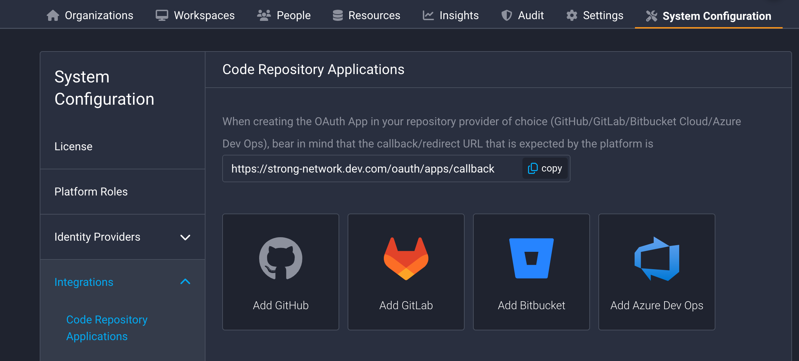
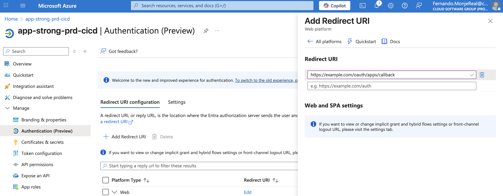
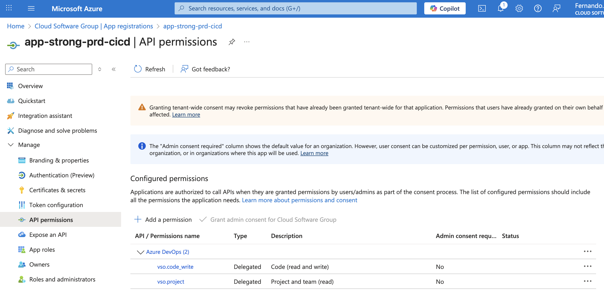
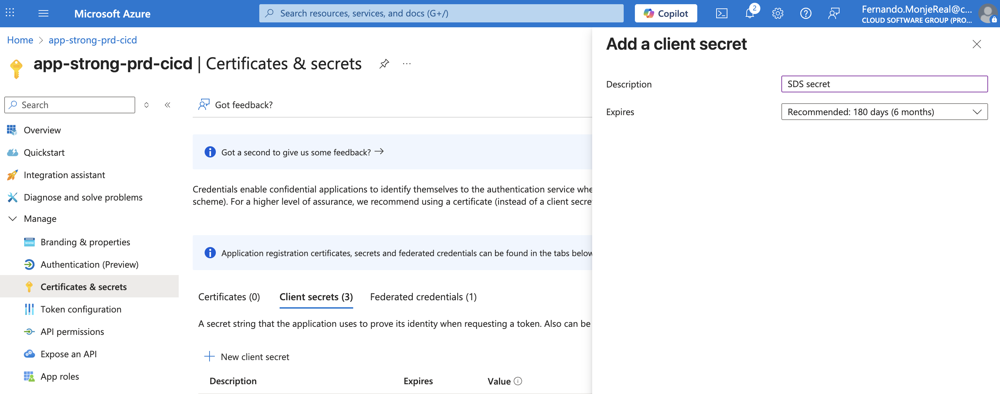
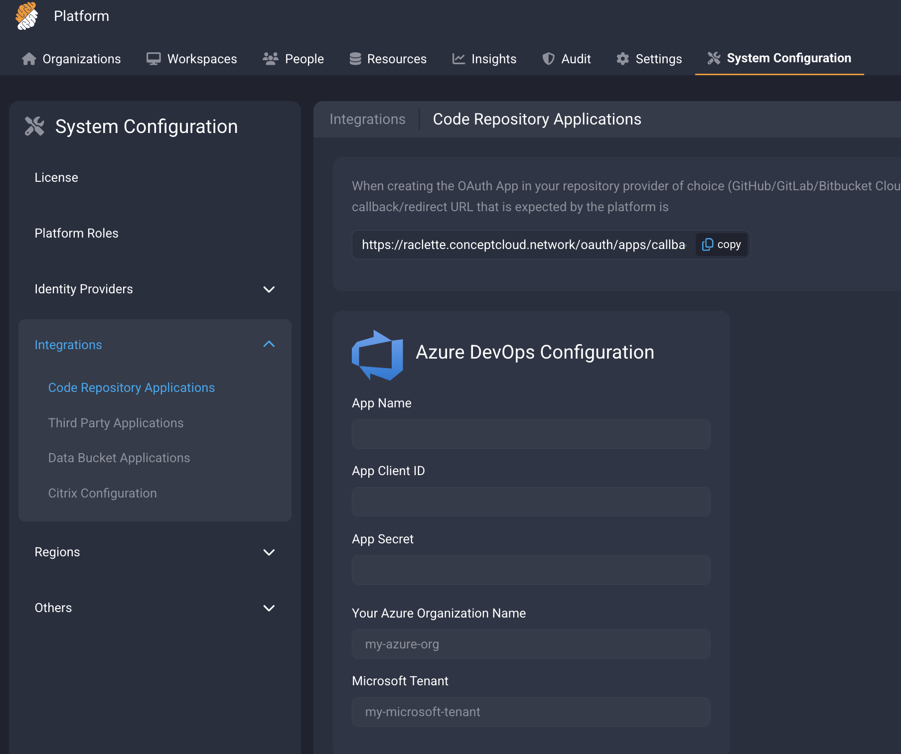
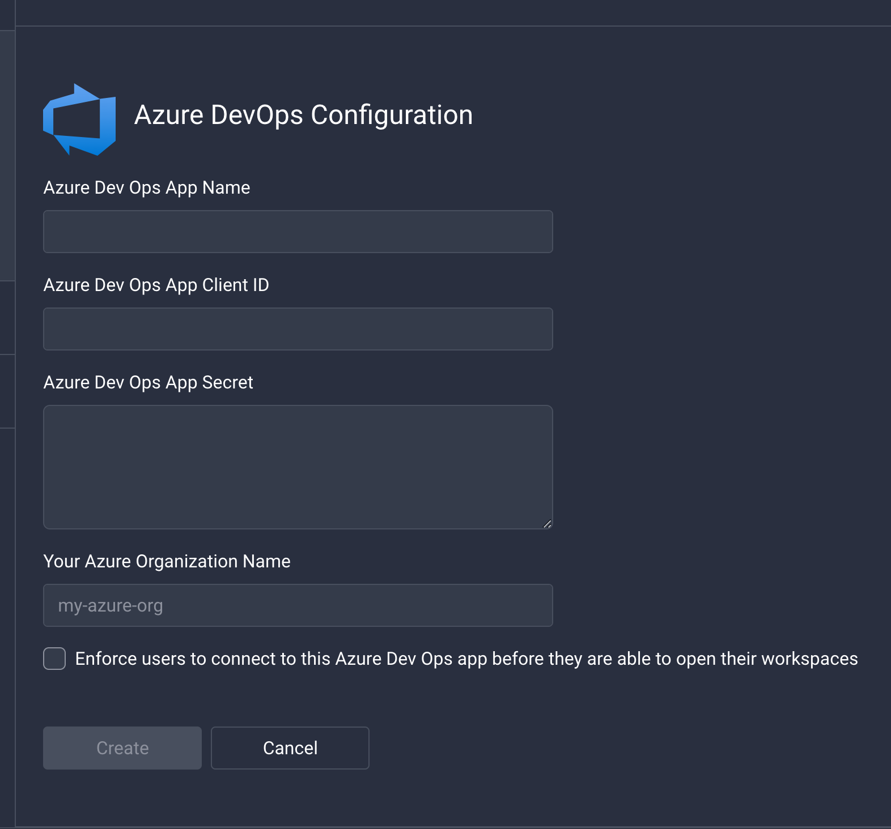

# Azure Dev Ops integration as Code Repository Provider

## Azure Dev Ops with Microsoft Entra ID OAuth (recommended)
Follow these steps to create an OAuth App using Microsoft Entra ID Oauth to connect it to the platform.

- Go to the Platform as Admin -> System Configuration -> Integrations -> Code Repository Applications or follow this URL: `https://example.com/platform/system_configuration/integrations/repos` where `example.com` has to be replaced by the URL of your deployment.

Click on "Add Azure Dev Ops". Copy the URL redirect URL that you will see there. You will need it for later. 
It will be `https://example.com/oauth/apps/callback` (replace `example.com` with the proper domain name).

- Navigate to [Azure](https://portal.azure.com), Microsoft Entra ID, open the Manage dropdown and click on App registrations. click on "New Registration"

Add the callback URL of the Platform in Azure. Go to "Authentication (Preview)". Then "Add Redirect URI". In the side menu select type Web. Paste the URL that you copied from the Platform.

Add the necessary API permissions:

Create a secret for the OAuth App:

Copy this secret as you will only see it once.

Finally, go to the Platform, and click on "Add Azure DevOps" you will need to provide:
- Secret
- Application (client) ID
- Directory (tenant) ID
The Application (client) ID and Directory (tenant) ID can be found in the Overview page of the Azure App Registration
- Specify the Azure Organization name. This application can only access repositories under this specific organization. To access repositories from different organizations, create multiple Azure DevOps Code Repository Applications, each with its corresponding organization name. You may use the same Client ID, Tenant ID and secret across all of them.

Paste Client ID, App Secret and Organization name from steps above: 

## Azure Dev Ops OAuth (deprecated)
Follow these steps to create an OAuth App in Azure DevOps to connect it to the platform.

- Using an Azure DevOps account, go to the following link:
   [Register an application](https://app.vsaex.visualstudio.com/app/register)

- Click on the "Add consumer" button and set the following fields:
   - **Company Name:** Your company’s name.
   - **Application Name:** The name you want to give to the application. It will be public.
   - **Application Website:** Set to `https://example.com/oauth/apps/callback` (replace `example.com` with the proper domain name).
   - **Authorization Callback URL:** Set to `https://example.com/oauth/apps/callback` (replace `example.com` with the proper domain name). This URL can be found in the admin panel of the Strong Network platform.
   - **Authorized Scopes:** `Code (read and write)` and `Project and team (read)`.

- Once done, click the "Create Application" button. You will be presented with the Client ID (called App ID) and the Secret (called Client Secret) after clicking the "Show" button. Enter these fields in the Admin configuration of the Strong Network platform.

   - [Register an application](https://app.vsaex.visualstudio.com/app/register)
   - `https://example.com/oauth/apps/callback`

- Specify the Azure Organization name. This application can only access repositories under this specific organization. To access repositories from different organizations, create multiple Azure DevOps Code Repository Applications, each with its corresponding organization name. You may use the same Client ID and Secret across all of them.

Paste Client ID, App Secret and Organization name from steps above: 

