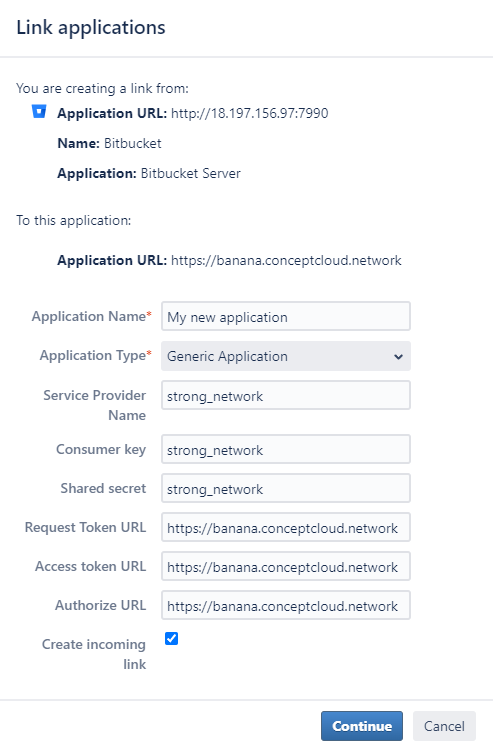
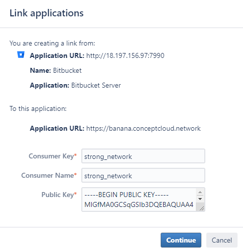

# Bitbucket Cloud Integration as Code Repository Provider

Follow these steps to create an OAuth App in Bitbucket Cloud to connect it to the platform:

- **Navigate to OAuth Consumers:**
  - Using a Bitbucket account, go to the main organization settings and then to "OAuth consumers".
  - You can follow this `https://bitbucket.org/[YOUR_DOMAIN_NAME]/workspace/settings/api` to reach this menu directly.

- **Add a New Consumer:**
  - Click on the "Add consumer" button and set the following fields:
    - **Name:** The name you want to give to the application. It will be public.
    - **Callback URL:** The URL should have a structure similar to `https://example.com/oauth/apps/callback`, where "example.com" should be replaced with the proper domain name. This URL can be seen from the admin panel of the Strong Network platform.
    - **This is a private consumer:** This should already be selected by default; leave it as it is.
    - **Scopes:** Select "Read" under the Account section and "Write" under the Repositories section. This can also be checked in the Strong Network Platform when clicking the "Add Bitbucket" button.

- **Complete the Registration:**
  - After clicking the "Save" button, you will be presented with the Client ID (called Key) and Secret, which you need to enter in the platform configuration.

---

# Bitbucket Server or Data Center Integration as Code Repository Provider

In this section, we will see how to connect the Strong Network platform to a self-hosted Bitbucket instance:

- **Configure Strong Network Platform:**
  - Go to the Strong Network platform settings and open the "Code Repository Applications" menu.
  - Click on the "Add Bitbucket" button.
  - Select the checkbox for "Bitbucket Server or Data Center (self-hosted)".

- **Set the Following Fields:**
  - **Bitbucket App Name:** It can be anything. This is what users will see when using this Code Repository Provider.
  - **Custom Domain:** Enter the URL where the Bitbucket instance is hosted. If no scheme is given, HTTPS will be chosen by default.
  - **Enforce Users to Connect:** If selected, users will need to connect to Bitbucket before they can open their workspaces. This can prevent misconfiguration/permission issues on the user side.

- **Complete the Registration:**
  - Click the "Create" button to complete the configuration on the Strong Network platform side.
  - Save the "Bitbucket Server Public Key" for later use. This can also be found in the edit menu after clicking the "Create" button.

- **Configure Bitbucket Instance (Version 7.20 or Later):**
  - Go to Administration > Applications > Application Links and click on "Create link":
    - **Application Type:** External application
    - **Direction:** Incoming
    - Click on continue
    - Set a unique name
    - **Redirect URL:** Set to `https://example.com/oauth/apps/callback`, where "example.com" should be replaced with the proper domain name.
    - **Application Permissions:** Account: Write, Repositories: Admin
    - After clicking the "Save" button, enter "strong_network" for both Client ID and Client Secret.

- **Configure Bitbucket Instance (Version 7.20 or Earlier):**
  - Go to Administration > Application Links.
  - Enter the platform URL (e.g., `https://example.com`, where "example.com" should be replaced with the proper domain name).
  - Click on "Create new link". If you see a "No response received" error, ignore it and click Continue.
  - In the following menu, enter:
    - **Application Name:** It can be anything.
    - **Application Type:** Generic Application
    - **Service Provider Name:** It can be anything (recommended: "strong_network").
    - **Consumer Key:** Set to "strong_network".
    - **Shared Secret:** Set to "strong_network".
    - **Request Token URL:** Set to `http://example.com`, where "example.com" should be replaced with the proper domain name.
    - **Access Token URL:** Set to `http://example.com`, where "example.com" should be replaced with the proper domain name.
    - **Authorize URL:** Set to `http://example.com`, where "example.com" should be replaced with the proper domain name.
    - Check "Create incoming link" and click Continue.

  - In the following menu, enter:
    - **Consumer Key:** Set to "strong_network".
    - **Consumer Name:** Set to "strong_network".
    - **Public Key:** Enter the value that can be seen in the platform.

- **Complete the Configuration:**
  - Click on Continue. The configuration is complete.
