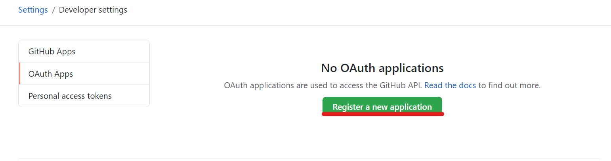
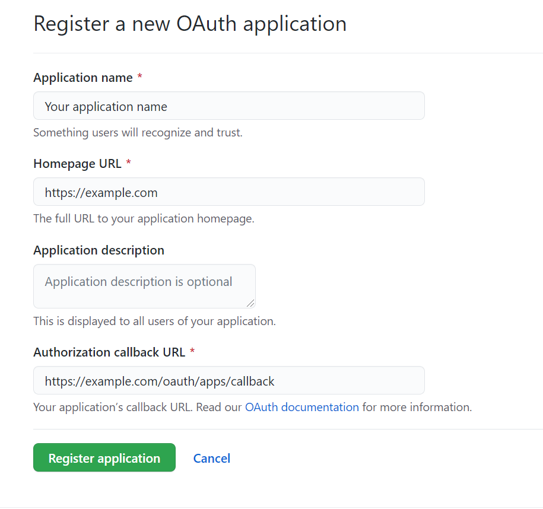

# GitHub Integration as Code Repository Provider

Follow these steps to create an OAuth App in GitHub to connect it to the platform:

- **Navigate to Developer Settings:**
  - Using a GitHub account, go to its settings and then to "Developer settings".
  - Inside this menu, click on "OAuth Apps".
  - You can follow this [https://github.com/settings/developers](https://github.com/settings/developers) to reach this menu directly.

- **Register New Application:**
  - Click on "Register new application" and you will be presented with a screen to set:
    - **Application Name:** At your discretion.
    - **Homepage URL:** The main route of the domain where the platform is running.
    - **Authorization Callback URL:** The URL should have a structure similar to `https://example.com/oauth/apps/callback`, where "example.com" should be replaced with the proper domain name (same as the Homepage URL).

- **Complete the Registration:**
  - When this process is done, click on the green button "Register application".
  - You will be redirected to a new application page where you can see the Client ID and generate the Secret that needs to be set in the platform configuration.

- **Give Organization Access:**
  - You will need to grant the organization access to this newly created OAuth app in the organization you want to connect to the platform.

