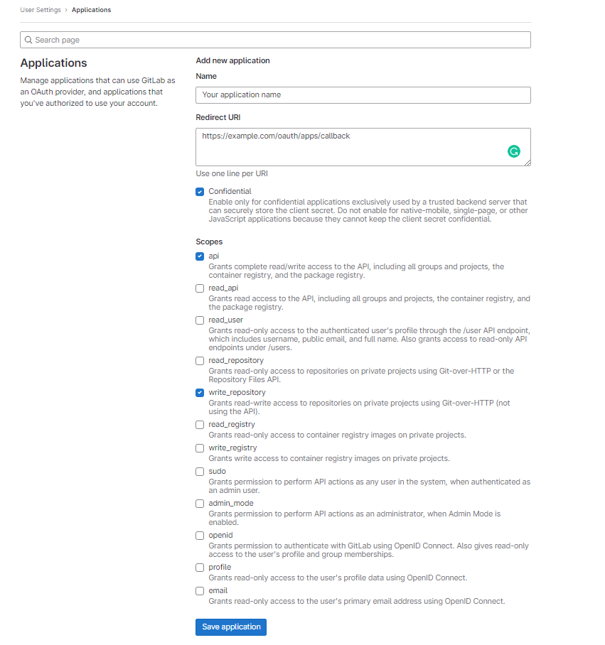
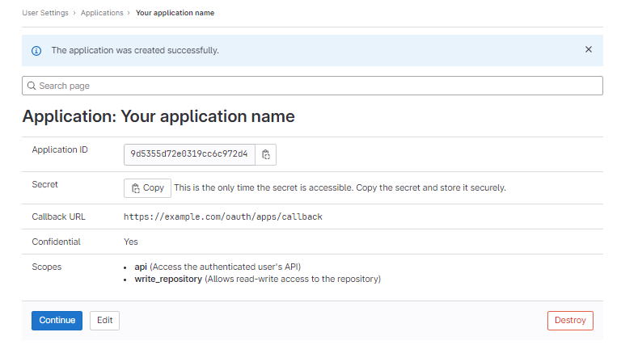

# GitLab Integration as Code Repository Provider

Follow these steps to create an OAuth App in GitLab to connect it to the platform:

- **Navigate to Applications:**
  - Using a GitLab account, go to user settings and then to "Applications".
  - You can follow this [https://gitlab.com/-/profile/applications](https://gitlab.com/-/profile/applications) to reach this menu directly.

- **Create a New OAuth App:**
  - Click on "New application" and set the following fields:
    - **Name:** The name you want to give to the application. It will be public.
    - **Redirect URI:** The URL should have a structure similar to `https://example.com/oauth/apps/callback`, where "example.com" should be replaced with the proper domain name.
    - **Confidential:** This should already be selected by default; leave it as it is.
    - **Scopes:** Add the `api` and `write_repository` scopes. These are needed to automatically deploy deployment keys.

- **Complete the Registration:**
  - After clicking the "Save application" button, you will be presented with the Client ID (called Application ID) and Secret, which you need to enter in the platform configuration.

