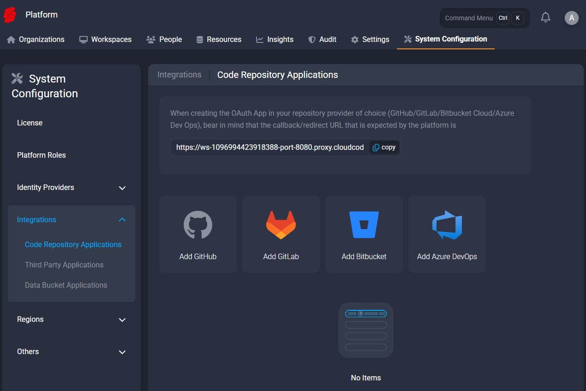

# Setup Code Repository Applications

This folder contains a list of guides on how to set up different code repositories:
- [GitHub](./Github.md)
- [GitLab](./Gitlab.md)
- [Bitbucket](./Bitbucket.md)
- [Azure DevOps](./AzureDevOps.md)

