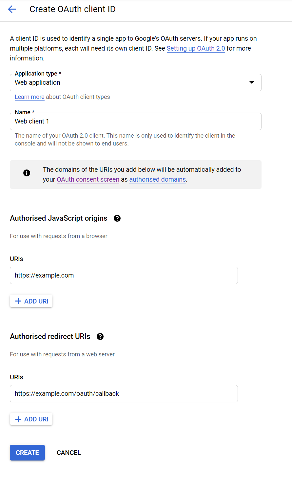

# Google Configuration as Identity Provider (OIDC)

To create an OAuth Client to use Google as an Identity Provider, follow these steps to obtain the OAuth Client ID and Secret required in the platform configuration:

- Go to the [Google API Console](https://console.developers.google.com/apis) and create a new project (or use an existing one). The project name, organization, and location are left at your discretion.

- Inside the project, click on “+ Create Credentials” and select “OAuth client ID” from the submenu.

- You will be presented with a warning to first configure an OAuth consent screen. Click on it. Select an external consent screen and click create. Fill in the fields at your discretion. The app name will be seen by users trying to log in to the platform.

- In the authorized domain, specify the domain in which the platform is deployed.
- Click on “Save and Continue” in the following menus without adding anything until you reach the summary page, then click on “Back to Dashboard”.
- Click on “Publish App”.

- Return to the Credentials page and create the credentials for an OAuth client ID.
- On this page, set the application type to “Web application”. The name is left at your discretion.
- In “Authorised JavaScript origins”, specify the domain name in which the platform is deployed. In “Authorised redirect URIs”, enter the redirect URL, similar to:
    - `https://example.com/oauth/callback`
    - Where “example.com” should be set to the proper domain name.

- Click on “Create” and note the Client ID and Secret for the platform configuration.

