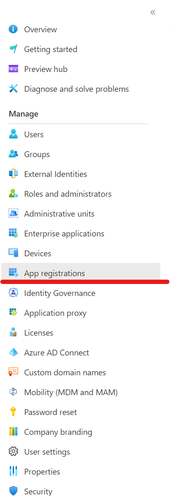
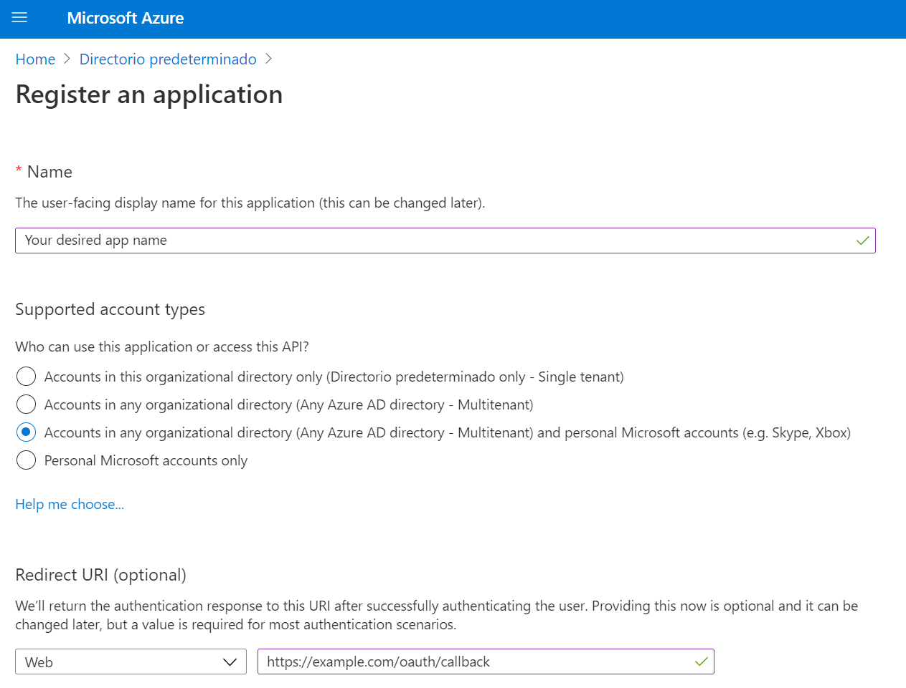
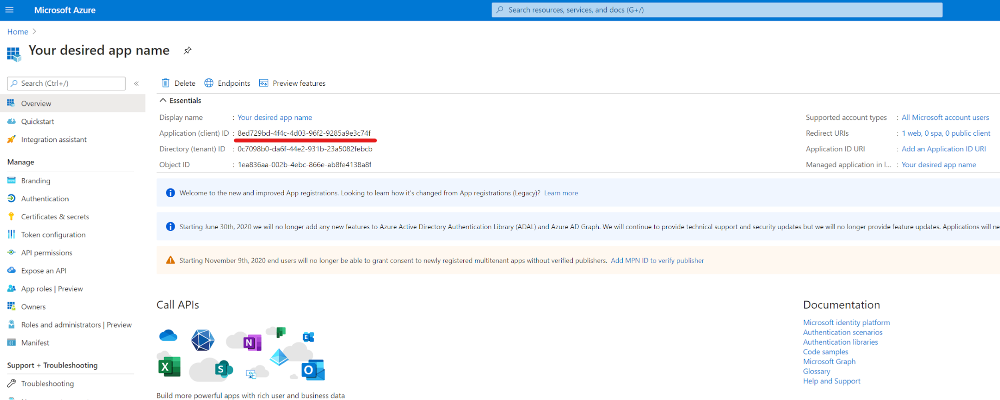
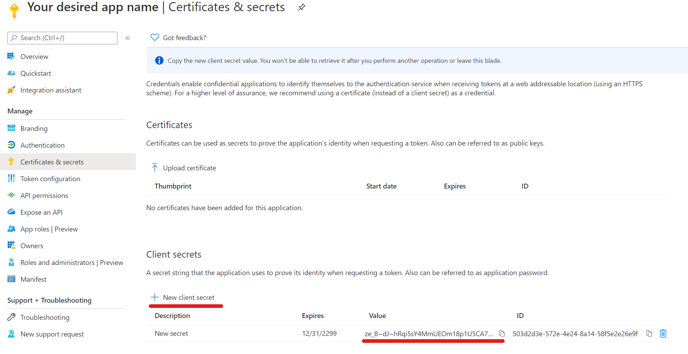

# Microsoft Azure Configuration as Identity Provider (OIDC)

The platform supports integration with Azure Active Directory for logging in with your Microsoft Azure account. To configure it:

- Go to the [Microsoft Azure portal](https://portal.azure.com/).
- Navigate to the Azure Active Directory.

- Click on “App registrations” and then “New registration”. Set the following:
  - **App name:** Choose a name that will be publicly visible to users logging into the platform.
  - **Supported account types:** We recommend selecting “Accounts in any organizational directory (Any Azure AD directory - Multitenant) and personal Microsoft accounts (e.g., Skype, Xbox)” to allow registered users to log in with their public domain accounts.
  - **Redirect URI:** Set the selector to “Web” and enter a URI similar to `https://example.strong.network/oauth/callback`.

- Click on “Register” at the bottom.

- On the next page, note the OAuth Client ID for the platform configuration.

- To obtain the secret, go to “Certificates & secrets” of the newly created app and click on “New client secret”. Enter this secret in the platform configuration to complete the setup.
  

## Single Logout (SLO) for Microsoft Azure

To enable Single Logout for the OIDC flow with Azure, configure the following:

- To log out users from Microsoft when they log out of the Strong Network platform, add another URL in the Redirect URI section with just the domain name used by the Strong Network platform. This URL is used to redirect users back after they log out of their Microsoft accounts.
- Add the optional claim called “login_hint” to the ID token:
  - Go to “Token configuration” and click on “Add optional claim”.
  - Select ID as token type and then select “login_hint”.
- To log the user out of the Strong Network platform when they log out of their Microsoft account, add the optional claim called “sid” to the ID token type.
- Add a Logout URL under the “Authentication” menu with the structure `https://[domain_name]/auth/logout`, where `domain_name` is the domain under which you have the Strong Network platform. This endpoint will be called by Microsoft when a user logs out to also log out the user from the Strong Network platform.
