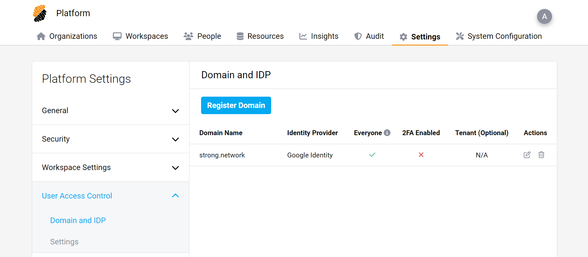
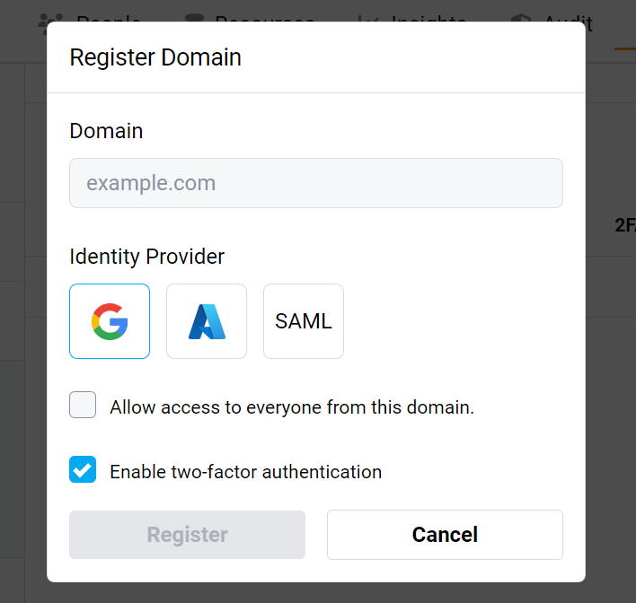

# Configure Platform Login

## Configure Login for Users

There are five ways users can log in to the platform:

- Google OAuth provider
- Microsoft OAuth provider (Azure)
- SAML
- OpenID Connect
- Username and password

After configuring the Identity Provider of choice (any of the first 4 options), it can be used to authenticate users of specified domains. These can be configured under User Access Control, in the submenu “Domain and IDP”.

If a domain is added, it means that when adding a user to the platform, that user will authenticate using the chosen Identity Provider.

In this menu, you may choose to check “Allow access to everyone from this domain” which will create user accounts on the fly, without the need to create the account beforehand. This is called Just-in-Time provisioning. This new user will not have any organization or project assigned to them.

You may also enable two-factor authentication which will use OTP on any user from the specified domain. If two-factor authentication is desired, we recommend setting it up either in your Identity Provider or in the platform to avoid asking the user to do the process twice.
