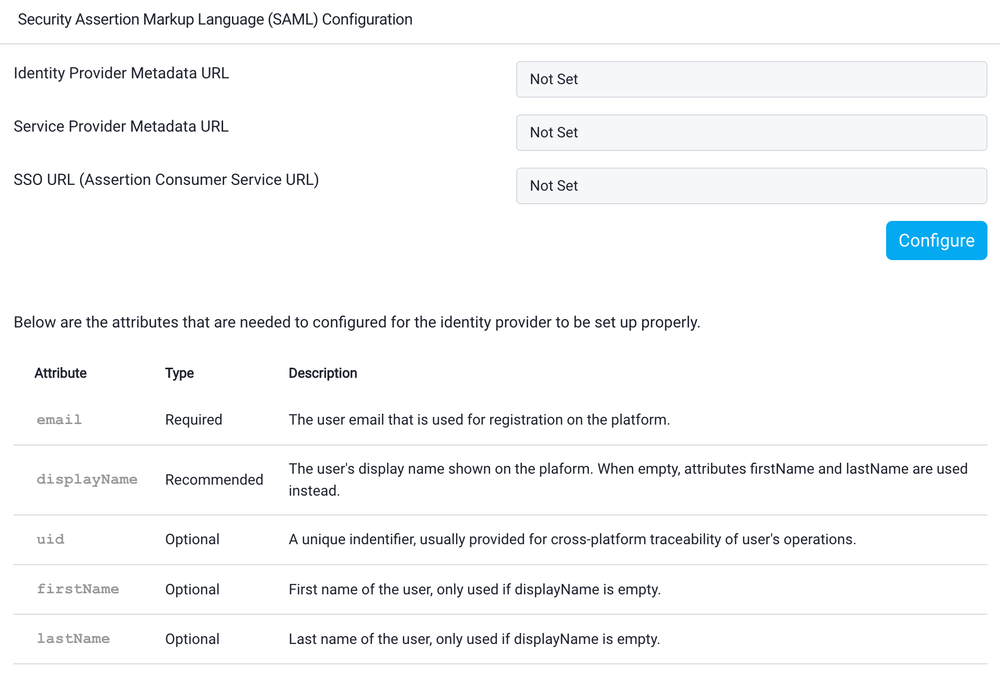

# SAML Service Provider
To seamlessly onboard your users already registered in Okta to the Strong Network Platform using the SAML 2.0 protocol, follow these steps:

- **Configure Your SAML Identity Provider:**
   - **Single Sign-On URL:** Set to `http(s)://example.strong.network/saml/acs` where “example.strong.network” is the domain where the platform is deployed.
   - **Audience URI:** Set to `http(s)://example.strong.network/saml/metadata`
   - **Attribute Statements:**
     - **email:** This attribute is mandatory, and the configuration won’t work without it.
     - **firstName:** Optional; if not set, the email will be used as the username.
     - **lastName:** Optional; if not set, the email will be used as the username.

-  **Configure the Strong Network Platform:**
   - Log in to the platform as the administrator.
   - Navigate to `http(s)://example.strong.network/platform/system_configuration/saml_sp` or click on System Configuration -> SAML Service Provider Configuration.
   - Click on the “Configure” button to upload the metadata of your SAML Identity Provider. You can upload it either through a metadata URL or by uploading a .xml file.

The SAML configuration is now complete and ready to use.
