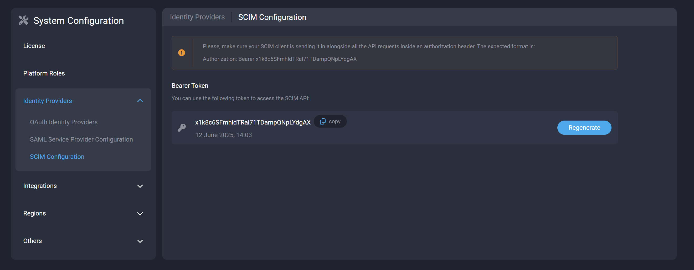
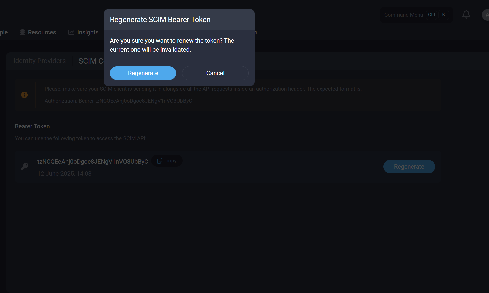

# SCIM Configuration

The Platform adheres to the SCIM 2.0 specification. It is used for the automatic provisioning, synchronization, and deprovisioning of users. The Platform supports both the `/Users` and `/Groups` endpoints.

* The **Users** endpoint is used to create, update, and delete users in the Strong Network Platform.
* The **Groups** endpoint is used to create, update, and delete groups in the Strong Network Platform. You can then map these groups to organization(s) and/or project(s) within the Strong Network Platform.

## Configure the SCIM Provider:

A token is required to authorize requests between your SCIM provider of choice and the Strong Network Platform. As an admin, you can obtain the token at:

**System Configuration → Identity Providers → SCIM Configuration**

`https://example.strong.network/system_configuration/identity_providers/scim`

Please ensure that your SCIM provider of choice—such as Microsoft Entra, Okta, or any other SCIM 2.0-compliant provider—includes this token in all API requests, using the following authorization header format:

`Authorization: Bearer <token>`

## Configure the Strong Network Platform:

No additional configuration is needed on the Strong Network Platform. SCIM is enabled by default.

You can renew the token at any time. Please note that renewing the token will invalidate any previously issued tokens.

