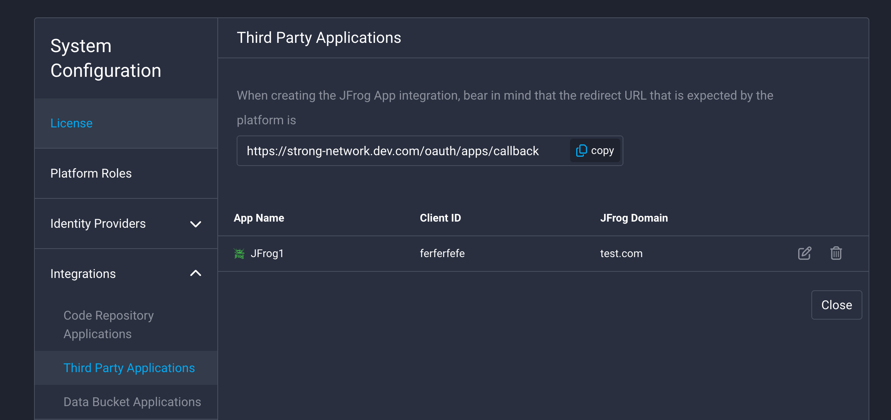

# Register JFrog as Third Party App

You can follow these steps to connect your JFrog instance and the Strong Network Platform.

At the moment this configuration can only be done in self-hosted JFrog instances.
```
artifactory:
  enabled: true
  frontend:
  extraEnvironmentVariables:
    - name: JF_FRONTEND_FEATURETOGGLER_ACCESSINTEGRATION
      value: "true"
  access:
  accessConfig:
    integrations-enabled: true
    integration-templates:
      - id: "1"
        name: "StrongNetwork"
        redirect-uri: "https://CODER_URL/oauth/apps/callback"
        scope: "applied-permissions/user"
```

After modifying the file, log in to your JFrog deployment as the admin go to Platform Management, then Manage Integrations. Go to the tab called “Application”. You can also follow the link:
`
https://[your_domain_name].jfrog.io/ui/admin/configuration/integrations
`


Click on “New Integration” of type “Application” and fill in the following fields:
- **Application Name:** Up to you.
- **Application Type:** Select the template you added in the values.yaml file.
- **Description:** Up to you.
- **Callback URL:** You can find it in the Third Party Applications admin menu in the Strong Network platform and has the format of `https://[your_strong_network_domain]/oauth/apps/callback`


Click on **`Generate Client ID & Secret`** and copy the values.

Lastly, log in as admin in the Strong Network Platform, go to System Configuration → Third Party Applications, and select JFrog. You will need to introduce:
- **Name:** Up to you, it will be displayed to the platform users
- **Client ID and Secret:** Values copied from JFrog
- **Domain:** Your JFrog domain

You can choose if you want the platform to trust insecure TLS certificates in case your JFrog deployment doesn’t have a valid certificate. You may also want users to always connect to JFrog before they access their workspaces, in this case, they will get a popup where they have to connect before opening them. If you don’t select this option they will get the popup but can dismiss it.


When the application is configured you can edit it by clicking on the edit icon on the right side.




You will see a menu in which you can change some settings. In said menu, you may change the default JFrog startup script. This is a script that will run in every workspace that is owned by a user who has connected their JFrog account. It can be useful to set up specific configurations in all workspaces, for example, to configure the different programming languages to fetch the dependencies from your JFrog platform. Each user can build on top of this script, to customize it to their own needs.

If this default script is updated it will be automatically changed for users who haven’t defined their custom script.


Finally, if you want to save the changes click on “Save”.
Now JFrog is configured across the Strong Network Platform, ready to be used seamlessly by the users.